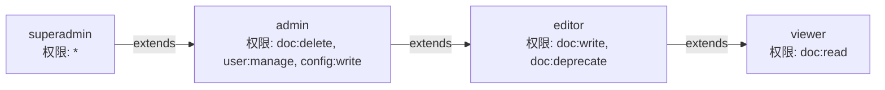

# 配置参考

所有配置文件位于项目根目录下的 `config/` 文件夹。服务启动时自动加载，大部分配置支持热加载（重启服务生效）。

## 配置文件一览

| 文件 | 用途 | 是否必填 |
|------|------|----------|
| `site.json` | 站点名称 | 是 |
| `roles.json` | 动态角色与权限定义 | 是 |
| `sequence.json` | 管理员登录序列码 | 否 |
| `settings.json` | 功能开关 | 否 |
| `auth.json` | JWT 密钥 / 启用用户认证 | 否 |
| `docs.json` | 文档索引（文件系统存储模式自动维护） | 自动生成 |
| `i18n/<locale>.json` | 语言翻译包 | 至少一个 |

---

## `site.json` — 站点名称

定义站点标题，显示在前端页面顶部和浏览器标签页。

```json
{
  "name": "25 电科 3 班待办事项清单"
}
```

| 字段 | 类型 | 说明 |
|------|------|------|
| `name` | `string` | 站点标题，显示在首页导航栏 |

---

## `roles.json` — 角色与权限

通过 JSON 动态定义角色、权限及继承关系。框架本身不硬编码任何角色，完全由部署者决定。

```json
{
  "roles": {
    "superadmin": {
      "permissions": ["*"],
      "extends": ["admin"]
    },
    "admin": {
      "permissions": ["doc:delete", "user:manage", "config:write"],
      "extends": ["editor"]
    },
    "editor": {
      "permissions": ["doc:write", "doc:deprecate"],
      "extends": ["viewer"]
    },
    "viewer": {
      "permissions": ["doc:read"],
      "extends": []
    },
    "anonymous": {
      "permissions": ["doc:read"],
      "extends": []
    }
  }
}
```

### 角色定义字段

| 字段 | 类型 | 说明 |
|------|------|------|
| `permissions` | `string[]` | 角色直接拥有的权限列表 |
| `extends` | `string[]` | 继承的角色名称，权限向上合并 |

### 权限格式

权限字符串格式为 `资源:操作`，框架识别以下内置权限：

| 权限 | 含义 |
|------|------|
| `*` | 通配符，匹配所有权限 |
| `doc:read` | 查看文档 |
| `doc:write` | 创建/编辑文档 |
| `doc:deprecate` | 弃用/恢复文档 |
| `doc:delete` | 删除文档 |
| `user:manage` | 用户管理 |
| `config:write` | 修改配置 |

### 继承链解析

框架在构建用户身份时，递归展开继承链并合并所有权限。以 `superadmin` 为例：



最终 `superadmin` 拥有 `*`（通配全部权限），`admin` 拥有 `doc:read, doc:write, doc:deprecate, doc:delete, user:manage, config:write`。

---

## `sequence.json` — 管理员登录序列

定义管理员登录时前端按钮的点击序列。仅在 `auth-simple` 模式下生效。

```json
{
  "sequence": [1, 2, 3, 2, 3, 4]
}
```

| 字段 | 类型 | 说明 |
|------|------|------|
| `sequence` | `number[]` | 正整数序列，前端按序点击数字按钮 |

> **安全提示**：此模式仅适合受信任的内网环境。生产环境建议使用 `auth-db` 模式（JWT + 密码）。

---

## `settings.json` — 功能开关

控制全局特性行为。

```json
{
  "show_deprecated": false,
  "show_deleted": false,
  "use_database": false
}
```

| 字段 | 类型 | 默认值 | 说明 |
|------|------|--------|------|
| `show_deprecated` | `bool` | `false` | 是否在列表中显示已弃用的文档 |
| `show_deleted` | `bool` | `false` | 是否在列表中显示已删除的文档 |
| `use_database` | `bool` | `false` | 是否使用 SQLite 存储替代文件系统存储 |

当 `use_database` 为 `true` 时：
- 服务启动时加载 `storage-sqlite` 插件
- 数据库文件创建在 `data/ducia.db`
- 提供原子操作、SQL 查询等高级特性

---

## `auth.json` — 认证配置

此文件存在即启用 `auth-db` 模式（JWT + 密码认证）。文件不存在时自动回退到 `auth-simple` 模式（序列码认证）。

```json
{
  "jwt_secret": "change-this-to-a-random-secret-key-in-production"
}
```

| 字段 | 类型 | 说明 |
|------|------|------|
| `jwt_secret` | `string` | JWT 签名密钥。生产环境务必使用随机字符串 |

> **安全提示**：JWT 密钥泄露意味着任何人都可以伪造 token。请务必生成高强度随机密钥并妥善保管。

---

## `docs.json` — 文档索引（自动维护）

文件系统存储模式下，由框架自动维护的文档元数据索引。**无需手动编辑**。

```json
{
  "next_id": 2,
  "docs": {
    "1": {
      "id": "1",
      "title": "示例文档",
      "file": "1.md",
      "created_at": 1782165910244,
      "deprecated": false,
      "deleted": false
    }
  }
}
```

| 字段 | 类型 | 说明 |
|------|------|------|
| `next_id` | `number` | 下一个文档的自增 ID |
| `docs` | `object` | 以文档 ID 为 key 的元数据字典 |

每条文档元数据包含：

| 字段 | 类型 | 说明 |
|------|------|------|
| `id` | `string` | 文档唯一 ID |
| `title` | `string` | 文档标题 |
| `file` | `string` | 内容文件路径（相对 `docs/`） |
| `created_at` | `number` | 创建时间戳（毫秒） |
| `deprecated` | `bool` | 是否已弃用 |
| `deleted` | `bool` | 是否已删除 |

---

## `i18n/<locale>.json` — 翻译包

语言翻译包存放在 `config/i18n/` 目录，以 locale 代码命名。框架会自动发现该目录下的所有 `.json` 文件。

### 文件结构

```json
{
  "@meta.name": "简体中文",
  "@meta.dir": "ltr",

  "site.title": "25 电科 3 班待办事项清单",

  "doc.status.loading": "加载中...",
  "doc.status.empty": "暂无文档，点击上传",

  "admin.title": "管理面板",
  "auth.session_expired": "会话已过期",
  "error.not_found": "文档未找到"
}
```

### 元数据字段

| 字段 | 类型 | 说明 |
|------|------|------|
| `@meta.name` | `string` | 语言显示名称（如 "简体中文"） |
| `@meta.dir` | `string` | 文字方向，`ltr`（左到右）或 `rtl`（右到左） |

### 翻译键命名规范

翻译键采用 `域.子域.具体信息` 的点分命名：

| 域 | 说明 | 示例 |
|----|------|------|
| `site.*` | 站点级文案 | `site.title` |
| `doc.*` | 文档相关 | `doc.status.loading`, `doc.action.upload` |
| `admin.*` | 管理面板 | `admin.title` |
| `auth.*` | 认证相关 | `auth.login_success` |
| `error.*` | 错误信息 | `error.not_found` |

### 添加新语言

1. 在 `config/i18n/` 下创建新文件，如 `ja.json`
2. 设置 `@meta.name` 和 `@meta.dir`
3. 翻译所有键值
4. 重启服务，前端语言选择器自动显示新语言
