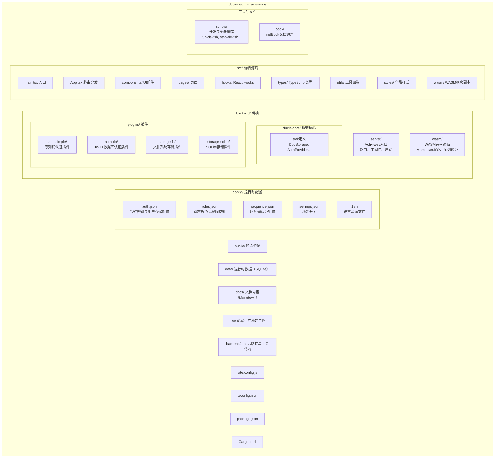

# 开发环境

本章介绍如何搭建 Ducia 的本地开发环境、运行测试以及项目目录结构。

---

## 环境要求

| 工具 | 最低版本 | 说明 |
|------|----------|------|
| Rust | 1.70+ | 后端编译、运行 |
| Node.js | 18+ | 前端构建、开发服务器 |
| npm | 随 Node.js | 包管理 |
| wasm-pack | 可选 | 仅修改 WASM 模块时需要 |

### 安装 Rust

```bash
curl --proto '=https' --tlsv1.2 -sSf https://sh.rustup.rs | sh
```

### 安装 Node.js

推荐使用 [nvm](https://github.com/nvm-sh/nvm) 管理版本。项目根目录有 `.nvmrc` 指定推荐版本：

```bash
nvm install
nvm use
```

### 安装 wasm-pack（可选）

```bash
curl https://rustwasm.github.io/wasm-pack/installer/init.sh -sSf | sh
```

---

## 一键启动

项目提供开发脚本，同时启动后端和前端：

```bash
# 在项目根目录执行
./scripts/run-dev.sh
```

该脚本完成以下步骤：

1. 检查 `cargo` 和 `npm` 是否可用
2. 如果 `docs/` 为空，创建示例文档 `docs/welcome.md`
3. 如果 `node_modules/` 不存在，自动执行 `npm install`
4. 启动后端：`cargo run -p ducia-server`（后台运行，日志输出到 `logs/backend.log`）
5. 等待后端就绪（探测 `http://127.0.0.1:3001/api/locales`）
6. 启动前端：`npm run dev`

> 按 `Ctrl+C` 停止时，脚本会通过 trap 自动清理后端进程。

浏览器访问：

```
http://localhost:5173
```

### 停止开发服务

```bash
./scripts/stop-dev.sh
```

---

## 分步启动

如果需要单独启动后端或前端：

### 启动后端

```bash
cd backend/server
cargo run
```

后端监听 `http://127.0.0.1:3001`。

首次运行会：

- 创建 `config/` 目录及默认配置文件
- 创建 `data/` 目录（SQLite 数据存放）
- 自动迁移数据库表

### 启动前端

```bash
# 在项目根目录执行
npm run dev
```

Vite 开发服务器监听 `http://localhost:5173`，API 请求自动代理到后端。

### 生产构建

```bash
npm run build     # 构建到 dist/
npm run preview   # 预览构建产物
```

---

## WASM 构建

仅修改 `backend/wasm/src/lib.rs` 时才需要重新构建 WASM：

```bash
cd backend/wasm
wasm-pack build --target web
```

构建产物输出到 `backend/wasm/pkg/`，包含：

- `ducia_wasm.js` — JS 胶水代码
- `ducia_wasm_bg.wasm` — WebAssembly 二进制
- `ducia_wasm.d.ts` — TypeScript 类型声明

然后需要将产物复制到前端：

```bash
# 从项目根目录
cp backend/wasm/pkg/*.js   src/wasm/
cp backend/wasm/pkg/*.wasm public/
cp backend/wasm/pkg/*.d.ts src/wasm/
```

详见 [WASM 构建](./wasm.md) 章节。

---

## 运行测试

### 后端测试

```bash
# 运行所有 crate 的测试
cd backend
cargo test

# 仅运行 ducia-core 核心库测试
cargo test -p ducia-core

# 运行特定插件的测试
cargo test -p ducia-storage-fs
cargo test -p ducia-storage-sqlite
cargo test -p ducia-auth-db
```

### 前端类型检查

由于前端使用 `tsconfig.json` 中的 `"noEmit": true`，编译仅做类型检查：

```bash
npx tsc --noEmit
```

该命令检查全部 `src/` 目录下的 TypeScript 类型正确性。

### 前端 Lint（可选）

项目未集成 ESLint，但 TypeScript `strict: true` 已提供较强的编译期检查。如需更多检查，可配置：

```bash
npm install -D eslint @typescript-eslint/parser @typescript-eslint/eslint-plugin
```

---

## 项目布局



### 关键路径说明

| 路径 | 用途 |
|------|------|
| `config/` | 所有配置文件。修改后**重启后端**生效 |
| `docs/` | Markdown 文档存放目录。上传/创建的文档写入此处 |
| `data/` | SQLite 数据库文件。使用 `storage-sqlite` 时创建 |
| `public/` | Vite 的静态资源根目录。WASM 二进制放于此 |
| `src/wasm/` | WASM JS 胶水代码副本。前端 import 的来源 |

---

## 配置切换

Ducia 通过 `config/` 目录下的 JSON 文件控制运行时行为：

| 场景 | 操作 |
|------|------|
| 启用 SQLite 存储 | 编辑 `config/settings.json`，设 `"use_database": true` |
| 回退序列码认证 | 删除 `config/auth.json` |
| 自定义角色权限 | 编辑 `config/roles.json` |
| 添加新语言 | 在 `config/i18n/` 中新增 `{locale}.json` |
| 修改序列码 | 编辑 `config/sequence.json` |

---

## 故障排查

### 后端启动失败

```bash
# 检查日志
cat logs/backend.log

# 常见原因：
# 1. 端口 3001 被占用 → lsof -i :3001
# 2. config 目录权限不足 → chmod -R 755 config/
# 3. Rust 版本过旧 → rustup update
```

### 前端无法连接后端

确认后端已启动且 Vite 代理配置正确：

```bash
# 测试后端健康
curl http://127.0.0.1:3001/api/locales
```

### TypeScript 类型错误

```bash
# 重新安装依赖
rm -rf node_modules package-lock.json
npm install

# 重新检查
npx tsc --noEmit
```
