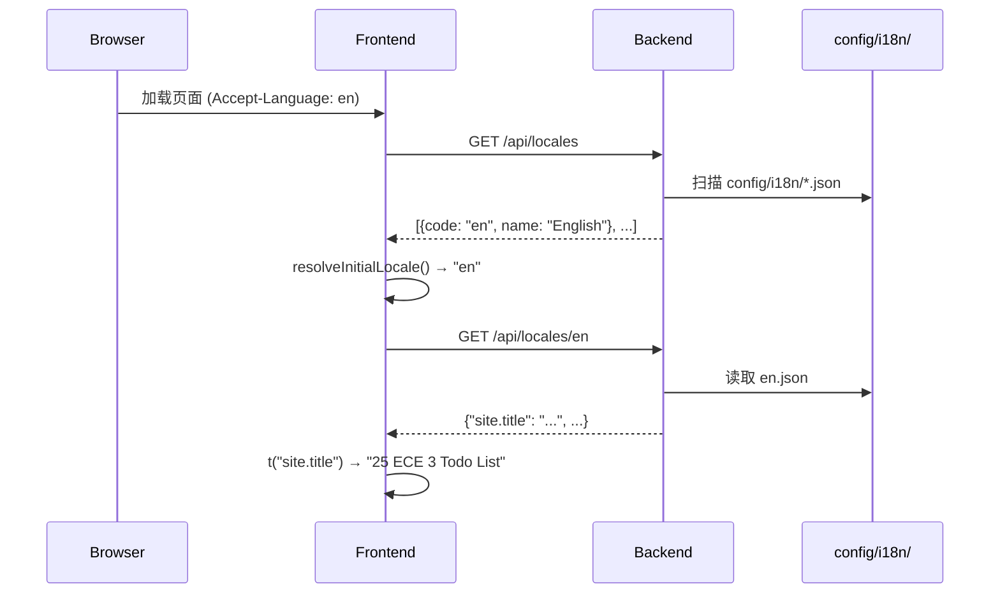

# 国际化（i18n）

Ducia 的国际化设计遵循**零硬编码**原则：所有用户可见文本从 JSON 语言包加载，前后端统一使用键查找翻译。

## 设计概览



核心流程：

1. 前端从后端获取可用语言列表
2. 前端解析用户偏好语言（sessionStorage → 浏览器 `Accept-Language` → 默认）
3. 前端加载对应的语言包
4. 组件中使用 `t("key")` 翻译，代码中不出现硬编码文本

## 后端：I18nManager

`I18nManager` 位于 `ducia-core/src/i18n/mod.rs`，负责语言包的加载、解析和翻译。

### 初始化

```rust
let i18n = I18nManager::load(&config_dir, "zh-CN");
```

`load()` 会扫描 `{config_dir}/i18n/` 目录下的所有 `.json` 文件，每个文件是一个语言包。

### 语言解析

```rust
pub fn resolve(&self, query_lang: Option<&str>, accept_lang: Option<&str>) -> String
```

解析顺序：

1. URL 查询参数 `?lang=`（最高优先级）
2. 请求头 `Accept-Language`
3. 默认语言（构造时指定，如 `"zh-CN"`）

支持前缀匹配：`zh` 能匹配到 `zh-CN`。

### 翻译方法

```rust
/// 简单翻译
pub fn t(&self, locale: &str, key: &str) -> String

/// 带参数的翻译（支持 {{param}} 插值）
pub fn tf(&self, locale: &str, key: &str, params: &HashMap<&str, &str>) -> String
```

回退链：**请求语言 → 默认语言 → `[key]` 标记**

```rust
// 假设默认语言是 zh-CN，en 语言包中没有 "doc.action.delete"
i18n.t("en", "doc.action.delete")
// → 查找 en 包 → 未找到 → 查找 zh-CN 包 → 返回 "删除"
// → 如果 zh-CN 也没有 → 返回 "[doc.action.delete]"
```

### 参数插值

`tf()` 方法支持 `{{param}}` 语法：

```rust
let mut params = HashMap::new();
params.insert("count", "5");
i18n.tf("zh-CN", "doc.list.count", &params);
// 如果语言包中 "doc.list.count": "共 {{count}} 篇文档"
// 返回 "共 5 篇文档"
```

### 可用语言列表

```rust
pub fn available_locales(&self) -> Vec<LocaleInfo>  // {code, name}
pub fn default_locale(&self) -> &str
```

## 前端：I18nProvider + useI18n()

### I18nProvider

`I18nProvider` 是一个 React Context Provider，包裹整个应用：

```tsx
// src/main.tsx
ReactDOM.createRoot(document.getElementById("root")!).render(
    <I18nProvider>
        <App />
    </I18nProvider>
);
```

初始化流程：

1. 挂载时调用 `GET /api/locales` 获取可用语言列表
2. 调用 `resolveInitialLocale()` 解析初始语言：
   - 优先 `sessionStorage` 中用户上次的选择
   - 其次浏览器 `navigator.language`
   - 短代码匹配（`zh` → `zh-CN`）
   - 最后回退到列表的第一个语言
3. 调用 `GET /api/locales/{locale}` 加载语言包
4. 语言包缓存到 `packCache` Map 中，切换语言时避免重复请求

### useI18n() hook

```tsx
function MyComponent() {
    const { t, locale, setLocale, availableLocales, loading } = useI18n();

    return (
        <div>
            <h1>{t("site.title")}</h1>
            <button onClick={() => setLocale("en")}>
                {t("doc.action.delete")}
            </button>
        </div>
    );
}
```

`t()` 函数签名：

```tsx
const t: (key: string, params?: Record<string, string | number>) => string
```

支持参数插值（与后端 `tf()` 一致的 `{{param}}` 语法）：

```tsx
t("doc.list.count", { count: 5 })
// 语言包: "doc.list.count": "共 {{count}} 篇文档"
// → "共 5 篇文档"
```

## API 端点

| 端点 | 方法 | 说明 |
|------|------|------|
| `/api/locales` | GET | 返回可用语言列表 + 默认语言 |
| `/api/locales/{locale}` | GET | 返回指定语言的完整语言包 |

成功响应格式：

```json
// GET /api/locales
{
  "success": true,
  "data": [
    {"code": "zh-CN", "name": "简体中文"},
    {"code": "en", "name": "English"}
  ],
  "default": "zh-CN"
}

// GET /api/locales/en
{
  "success": true,
  "data": {
    "@meta.name": "English",
    "@meta.dir": "ltr",
    "site.title": "25 ECE 3 Todo List",
    "doc.action.delete": "Delete"
  }
}
```

## 语言包结构

语言包是标准的 JSON 文件，存放在 `config/i18n/` 目录：

```json
{
  "@meta.name": "English",
  "@meta.dir": "ltr",

  "site.title": "25 ECE 3 Todo List",

  "doc.status.loading": "Loading...",
  "doc.status.empty": "No documents yet, click upload",
  "doc.status.deprecated": "This document is deprecated",
  "doc.status.content_lost": "Document content lost",

  "doc.action.restore": "Restore",
  "doc.action.delete": "Delete",
  "doc.action.confirm_delete": "Confirm Delete",
  "doc.action.mark_deprecated": "Mark Deprecated",
  "doc.action.download": "Download",
  "doc.action.upload": "Upload",

  "doc.upload.only_md": "Please upload .md files only",
  "doc.upload.title_hint": "Upload Document",

  "admin.title": "Admin Panel",
  "admin.button_home": "Home",
  "admin.error.invalid_seq": "Invalid sequence, please retry",

  "auth.session_expired": "Session expired",
  "auth.login_success": "Login successful",

  "error.not_found": "Document not found",
  "error.server_error": "Server error",
  "error.generic": "Operation failed"
}
```

约定：

- `@meta.name` 和 `@meta.dir` 是元数据字段，用于 UI 展示
- 其他键遵循 `{域}.{分类}.{具体}` 的命名规范

## 键命名规范

采用**点分隔**的层级命名，便于组织和查找：

| 前缀 | 含义 | 示例 |
|------|------|------|
| `site.` | 站点全局 | `site.title` |
| `doc.status.` | 文档状态文案 | `doc.status.loading` |
| `doc.action.` | 文档操作按钮 | `doc.action.delete` |
| `doc.upload.` | 上传相关 | `doc.upload.title_hint` |
| `admin.` | 管理面板 | `admin.title` |
| `auth.` | 认证相关 | `auth.login_success` |
| `error.` | 错误提示 | `error.not_found` |

## 如何添加新语言

以添加日语（ja）为例：

### 1. 创建语言包文件

```bash
# 复制现有语言包为模板
cp config/i18n/en.json config/i18n/ja.json
```

### 2. 翻译所有值

编辑 `config/i18n/ja.json`：

```json
{
  "@meta.name": "日本語",
  "@meta.dir": "ltr",

  "site.title": "25 電子 3 タスクリスト",

  "doc.status.loading": "読み込み中...",
  "doc.status.empty": "ドキュメントがありません",
  "doc.action.delete": "削除",
  "doc.action.upload": "アップロード",

  "admin.title": "管理パネル",
  "error.not_found": "ドキュメントが見つかりません"
}
```

### 3. 重启服务

后端在启动时自动扫描 `config/i18n/` 目录，无需修改代码。重启服务后，前端会在语言选择器中列出新的语言选项。

### 无后端模式

如果只需要前端翻译（不经过后端 API），可以直接在语言包中添加键值对：

```json
{
  "my.custom.key": "カスタムテキスト"
}
```

然后在组件中通过 `t("my.custom.key")` 使用。
