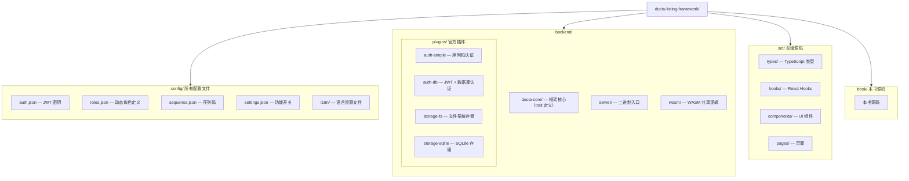

# 简介

**Ducia Listing Framework** 是一个轻量级、插件化的文档管理系统。

## 设计理念

- **框架本体极简**：只定义接口契约，不绑定具体实现
- **一切皆插件**：存储、认证、可见性——通过插件注入
- **零硬编码**：所有字符串从语言包资源文件加载
- **动态角色**：不预设 admin/editor/viewer，部署者自定义

## 技术栈

| 层 | 技术 |
|----|------|
| 后端 | Rust + Actix-web 4 |
| 前端 | React 18 + TypeScript + Vite |
| 数据库（可选） | SQLite (rusqlite) |
| 身份认证 | JWT + bcrypt（内置），或外部服务 |
| 文档渲染 | pulldown-cmark (WASM) / react-markdown |
| 国际化 | JSON 语言包 + 请求级语言解析 |
| 构建工具 | Cargo + npm + wasm-pack |

## 项目结构

