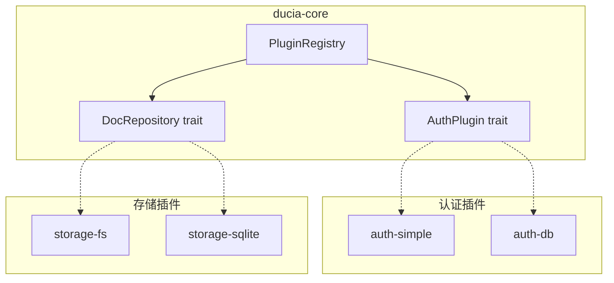

# 插件系统

插件系统是 Ducia 的骨架。框架本体只定义 trait 契约，所有业务逻辑通过插件注入。

## 设计原则

- **面向 trait 编程**：框架不 import 任何具体插件实现，只依赖 `ducia-core` 中定义的 trait
- **一对多可替换**：一个 trait 可以有多个实现，部署时按配置选择
- **编译时组合**：插件在 `main.rs` 编译时注册，非运行时动态加载

## 插件架构图



## AuthPlugin trait

定义在 `ducia-core/src/plugin/auth.rs`，是认证机制的抽象接口：

```rust
#[async_trait]
pub trait AuthPlugin: Send + Sync {
    /// 插件唯一名称
    fn name(&self) -> &str;

    /// 从请求头中提取身份，返回 None 表示匿名
    async fn authenticate(&self, headers: &HashMap<String, String>) -> Option<Identity>;

    /// 创建会话，返回 token/凭证
    async fn create_session(&self, identity: &Identity) -> Result<String>;

    /// 销毁会话
    async fn destroy_session(&self, token: &str) -> Result<()>;

    /// 检查会话是否有效
    async fn check_session(&self, token: &str) -> Option<Identity>;
}
```

每个方法的职责：

- `authenticate` — handler 将请求头传入，插件负责从中提取身份。这是**请求入口**，失败返回 `None` 表示匿名用户
- `create_session` — 给定一个 `Identity`，创建持久会话并返回 token。SimpleAuth 生成 UUID 存内存，AuthDb 签发 JWT
- `destroy_session` — 销毁指定会话。SimpleAuth 从 HashMap 移除，JWT 无法服务端销毁（直接返回 `Ok(())`）
- `check_session` — 验证 token 有效性并返回身份

匿名用户通过 `ducia_core::plugin::auth::anonymous()` 函数创建：

```rust
pub fn anonymous() -> Identity {
    Identity {
        id: "anonymous".into(),
        roles: vec!["anonymous".into()],
        permissions: vec!["doc:read".into()],
        metadata: Default::default(),
    }
}
```

## DocRepository trait

定义在 `ducia-core/src/doc/repo.rs`，是文档存储的抽象接口：

```rust
#[async_trait]
pub trait DocRepository: Send + Sync {
    /// 插件名称
    fn name(&self) -> &str;

    /// 列出所有文档
    async fn list_docs(&self, include_deleted: bool) -> Result<Vec<DocMeta>>;

    /// 获取单个文档完整内容
    async fn get_doc(&self, id: &str) -> Result<Option<DocFull>>;

    /// 创建文档
    async fn create_doc(&self, req: CreateDocRequest) -> Result<DocMeta>;

    /// 更新文档元数据（弃用/删除标记）
    async fn update_meta(
        &self, id: &str,
        deprecated: Option<bool>,
        deleted: Option<bool>,
    ) -> Result<()>;

    /// 获取站点名称
    async fn site_name(&self) -> String;
}
```

## StoragePlugin 类型别名

存储插件不需要额外的 trait——它直接使用 `DocRepository` 的 trait object：

```rust
pub type StoragePlugin = Box<dyn DocRepository>;
```

## PluginRegistry

`PluginRegistry` 是插件的容器，用 builder 模式构建：

```rust
pub struct PluginRegistry {
    auth: Option<Arc<dyn AuthPlugin>>,
    storage: Option<StoragePlugin>,
    extras: HashMap<String, Box<dyn std::any::Any + Send + Sync>>,
}

impl PluginRegistry {
    pub fn new() -> Self { /* 空注册表 */ }

    pub fn with_auth(mut self, plugin: Arc<dyn AuthPlugin>) -> Self { /* ... */ }

    pub fn with_storage(mut self, plugin: StoragePlugin) -> Self { /* ... */ }

    pub fn auth(&self) -> Option<&Arc<dyn AuthPlugin>> { /* ... */ }

    pub fn storage(&self) -> Option<&StoragePlugin> { /* ... */ }

    pub fn register_extra<T: 'static + Send + Sync>(&mut self, name: &str, plugin: T) { /* ... */ }
}
```

## 现有插件

### auth-simple（序列码认证）

- 路径：`backend/plugins/auth-simple/`
- 依赖：`ducia-core`、`tokio`、`uuid`
- 原理：前端通过序列码按钮交互验证，后端验证序列后创建内存中的 UUID session
- 配置：`config/sequence.json`（定义验证序列数组）
- 特点：最简单，无需数据库，适合开发调试或单机单用户

```rust
pub struct SimpleAuth {
    config_dir: PathBuf,
    sessions: Mutex<HashMap<String, Identity>>,
}
```

### auth-db（数据库认证）

- 路径：`backend/plugins/auth-db/`
- 依赖：`ducia-core`、`rusqlite`、`bcrypt`、`jsonwebtoken`、`chrono`
- 原理：用户名+密码注册（bcrypt 哈希），登录返回 JWT（7天有效），Bearer Token 认证
- 配置：`config/auth.json`（`jwt_secret` 字段）
- 特点：多用户支持，持久化，支持注册/登录/获取用户信息

```rust
pub struct AuthDb {
    conn: Mutex<Connection>,
    jwt_secret: String,
}
```

### storage-fs（文件系统存储）

- 路径：`backend/plugins/storage-fs/`
- 依赖：`ducia-core`、`serde_json`
- 原理：`config/docs.json` 存储元数据索引，`docs/` 目录存储 `.md` 文件
- 特点：零外部依赖，人类可读，适合单机部署和手动编辑

### storage-sqlite（SQLite 存储）

- 路径：`backend/plugins/storage-sqlite/`
- 依赖：`ducia-core`、`rusqlite`
- 原理：所有文档和元数据存入 SQLite，文件内容仍按文件存储到 `docs/`
- 特点：原子操作，SQL 查询，并发安全，数据结构化管理

## 如何编写一个新的存储插件

以编写一个 `storage-redis` 为例：

### 1. 创建 crate

```bash
mkdir -p backend/plugins/storage-redis/src
```

### 2. 编写 Cargo.toml

```toml
[package]
name = "ducia-storage-redis"
version = "0.1.0"
edition = "2024"

[dependencies]
ducia-core = { path = "../../ducia-core" }
redis = "0.25"
async-trait = "0.1"
anyhow = "1"
serde_json = "1"
tokio = { version = "1", features = ["full"] }
```

### 3. 实现 DocRepository trait

```rust
// src/lib.rs
use async_trait::async_trait;
use ducia_core::doc::model::{CreateDocRequest, DocFull, DocMeta};
use ducia_core::doc::repo::DocRepository;
use redis::Client;

pub struct RedisStorage {
    client: Client,
}

impl RedisStorage {
    pub fn new(redis_url: &str) -> anyhow::Result<Self> {
        Ok(Self {
            client: Client::open(redis_url)?,
        })
    }
}

#[async_trait]
impl DocRepository for RedisStorage {
    fn name(&self) -> &str {
        "storage-redis"
    }

    async fn list_docs(&self, include_deleted: bool) -> anyhow::Result<Vec<DocMeta>> {
        // 从 Redis 中读取文档列表...
        todo!()
    }

    async fn get_doc(&self, id: &str) -> anyhow::Result<Option<DocFull>> {
        // 从 Redis 中读取单个文档...
        todo!()
    }

    async fn create_doc(&self, req: CreateDocRequest) -> anyhow::Result<DocMeta> {
        // 将文档存入 Redis...
        todo!()
    }

    async fn update_meta(
        &self, id: &str,
        deprecated: Option<bool>,
        deleted: Option<bool>,
    ) -> anyhow::Result<()> {
        todo!()
    }

    async fn site_name(&self) -> String {
        "My Redis Site".into()
    }
}
```

### 4. 在 server 中注册

在 `backend/server/Cargo.toml` 添加依赖：

```toml
ducia-storage-redis = { path = "../plugins/storage-redis" }
```

在 `backend/server/src/main.rs` 中注册：

```rust
use ducia_storage_redis::RedisStorage;

let storage_plugin: StoragePlugin = Box::new(
    RedisStorage::new("redis://127.0.0.1:6379")?
);
```

同样的流程适用于编写新的认证插件——只需实现 `AuthPlugin` trait 并在 `main.rs` 中注册即可。
